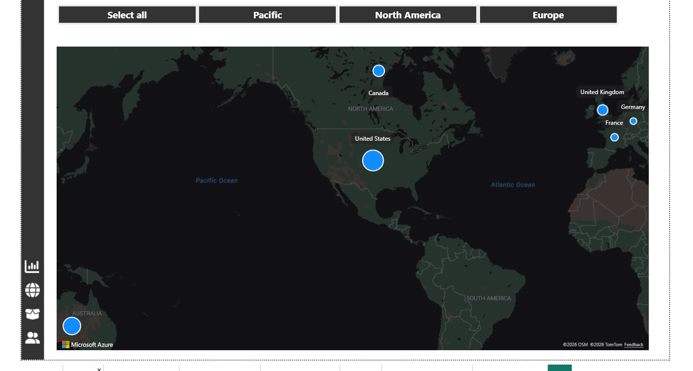
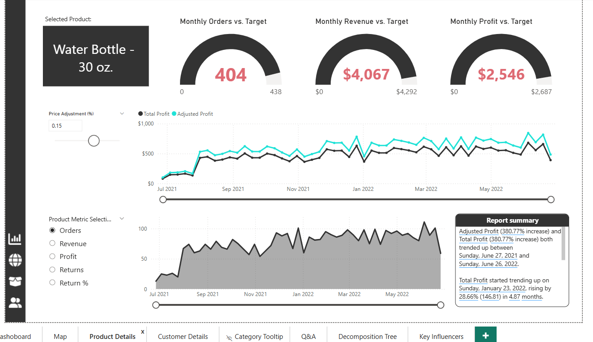

# AdventureWorks Business Intelligence Dashboard | Power BI

A comprehensive Business Intelligence solution built in Power BI to analyze global sales performance, product trends, regional distribution, and customer behavior for a manufacturing company.

The dashboard transforms transactional data into actionable insights through structured data modeling, advanced DAX calculations, and interactive reporting.

---

## Key Results

- Generated $24.9M in total revenue across 25.2K orders  
- Identified Accessories as the highest order-driving category  
- Determined North America as the strongest regional market  
- Revealed expansion opportunities in Asia, Africa, and South America  
- Identified high-value customer segments for targeted strategy  

---

## Business Questions Addressed

- What is the overall financial performance of the company?
- How are revenue, profit, and return rates trending over time?
- Which regions generate the highest order volume?
- Which product categories and subcategories drive performance?
- Which products show elevated return behavior?
- Who are the highest value customers?
- What factors influence customer characteristics?

---

## Executive Dashboard

The Executive page provides a consolidated KPI overview:

- Revenue: $24.9M  
- Profit: $10.5M  
- Orders: 25.2K  
- Return Rate: 2.2%

Accessories lead total order volume, followed by Bikes and Clothing.  
Interactive filtering allows comparison by region and year.

---

## Geographic Analysis

An interactive map visualizes global order distribution:

- United States: ~8,700 orders  
- Pacific region: ~6,060 orders  
- Europe: Moderate activity  
- No sales in Asia, Africa, or South America  

This highlights both strong regional performance and untapped market opportunities.

---

## Product Performance (Drillthrough Analysis)

A dedicated drillthrough page enables detailed product-level investigation.

### Features Implemented

- Drillthrough navigation from Top 10 products  
- Monthly comparison vs target (Orders, Revenue, Profit)  
- What-If parameter for scenario simulation  
- Dynamic narrative summaries  

### Example Insight

Water Bottle – 30 oz. is the highest-volume product (3,983 orders), indicating strong demand for low-cost accessory items. High-frequency products play a critical role in sustaining overall transaction volume.

---

## Customer Analysis

The Customer page evaluates segmentation and value contribution.

### Metrics Included

- Unique Customers  
- Revenue per Customer  
- Top 100 Customer Ranking  
- Orders by Income Level  
- Orders by Occupation  

Revenue per customer varies significantly across segments, supporting targeted marketing and retention strategies. High-value customers can be identified for focused engagement initiatives.

---

## AI-Powered Insights

### Decomposition Tree

Used to identify sales drivers across Category → Subcategory → Product.

Dominant path:
Accessories → Tires and Tubes → Patch Kit/8 Patches

This reveals high-frequency maintenance products as key contributors to order volume.

### Key Influencers

Used to analyze drivers of customer characteristics (e.g., HomeOwner status).

Findings indicate marital status, income level, and education significantly influence ownership probability.

These visuals extend analysis beyond descriptive reporting into behavioral pattern discovery.

---

## Technical Implementation

- Star Schema Data Modeling  
- Time Intelligence (YTD, Previous Month, Growth %)  
- Custom DAX Measures  
- What-If Parameter Simulation  
- Drillthrough Pages  
- Bookmark-Based Interactions  
- AI Visualizations  

---

## Tools Used

- Power BI Desktop  
- Power Query (ETL & Data Transformation)  
- DAX (Advanced Calculations)  
- Star Schema Data Modeling  

---

## Dashboard Screenshots

### Executive Dashboard

### Geographic Analysis

### Product Drillthrough

### Customer Segmentation

### Data Model

---

## Conclusion

This project demonstrates the end-to-end development of a scalable Business Intelligence solution using Power BI.

It reflects strong analytical thinking, structured data modeling, advanced DAX capability, and business-focused storytelling — delivering actionable insights suitable for executive decision-making.
